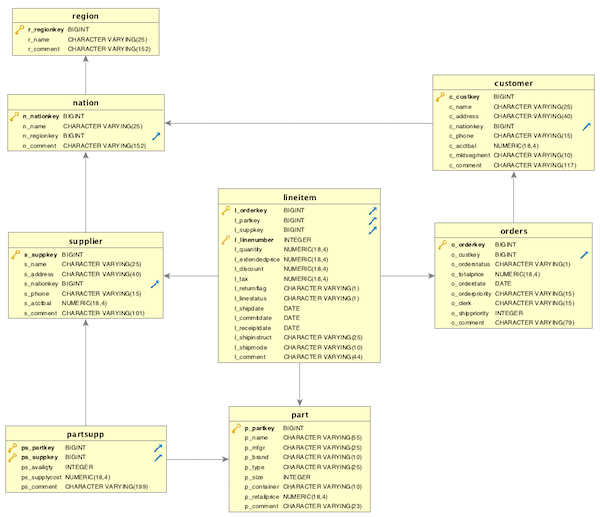

# LAB 2 - Data Loading
In this lab, you will use a set of eight tables based on the TPC Benchmark data model.  You create these tables within your Redshift cluster and load these tables with sample data stored in S3.  


## Contents
* [Before You Begin](#before-you-begin)
* [Cloud Formation](#cloud-formation)
* [Create Tables](#create-tables)
* [Loading Data](#loading-data)
* [Table Maintenance - ANALYZE](#table-maintenance---analyze)
* [Table Maintenance - VACUUM](#table-maintenance---vacuum)
* [Troubleshooting Loads](#troubleshooting-loads)
* [Before You Leave](#before-you-leave)

## Before You Begin
This lab assumes you have launched a Redshift cluster and can gather the following information.  If you have not launched a cluster, see [LAB 1 - Creating Redshift Clusters](../lab1/README.md).
* [Your-AWS_Account_Id]
* [Your-Redshift_Hostname]
* [Your-Redshift_Port]
* [Your-Redshift_Username]
* [Your-Redshift_Password]
* [Your-Redshift-Role]

## Cloud Formation
To complete the loading of this sample data automatically using cloud formation, use the following link.
[](https://console.aws.amazon.com/cloudformation/home?#/stacks/new?stackName=ImmersionLab2&templateURL=https://s3-us-west-2.amazonaws.com/redshift-immersionday-labs/lab2.yaml)

Note: This cloud formation template will create a Lambda function which will trigger each of the data loads.  In order to trigger these loads securely, the Lambda function will be deployed to the same VPC as the Redshift cluster in a new set of Private Subnets with a NAT Gateway allowing the function to communicate to the Redshift Cluster.  In order to create this stack, you will need to gather the following information in addition to the items above.
* [Your-Redshift-VPC]
* [Your-Redshift-Subnet]
* [Your-Redshift-SecurityGroup]

## Create Tables
Copy the following create table statements to create tables in the database.  
```
DROP TABLE IF EXISTS region;
CREATE TABLE region (
  R_REGIONKEY bigint NOT NULL PRIMARY KEY,
  R_NAME varchar(25),
  R_COMMENT varchar(152))
diststyle all;

DROP TABLE IF EXISTS nation;
CREATE TABLE nation (
  N_NATIONKEY bigint NOT NULL PRIMARY KEY,
  N_NAME varchar(25),
  N_REGIONKEY bigint REFERENCES region(R_REGIONKEY),
  N_COMMENT varchar(152))
diststyle all;

DROP TABLE IF EXISTS customer;
create table customer (
  C_CUSTKEY bigint encode zstd NOT NULL PRIMARY KEY,
  C_NAME varchar(25) encode zstd,
  C_ADDRESS varchar(40) encode zstd,
  C_NATIONKEY bigint encode zstd REFERENCES nation(N_NATIONKEY),
  C_PHONE varchar(15) encode zstd,
  C_ACCTBAL decimal(18,4) encode zstd,
  C_MKTSEGMENT varchar(10),
  C_COMMENT varchar(117) encode zstd)
diststyle all;

DROP TABLE IF EXISTS orders;
create table orders (
  O_ORDERKEY bigint encode zstd NOT NULL PRIMARY KEY,
  O_CUSTKEY bigint encode zstd REFERENCES customer(C_CUSTKEY),
  O_ORDERSTATUS varchar(1) encode zstd,
  O_TOTALPRICE decimal(18,4) encode zstd,
  O_ORDERDATE Date encode zstd,
  O_ORDERPRIORITY varchar(15),
  O_CLERK varchar(15) encode zstd,
  O_SHIPPRIORITY Integer encode zstd,
  O_COMMENT varchar(79) encode zstd)
distkey (O_ORDERKEY)
sortkey (O_ORDERDATE);

DROP TABLE IF EXISTS part;
create table part (
  P_PARTKEY bigint encode zstd NOT NULL PRIMARY KEY,
  P_NAME varchar(55),
  P_MFGR  varchar(25)  encode zstd,
  P_BRAND varchar(10),
  P_TYPE varchar(25),
  P_SIZE integer  encode zstd,
  P_CONTAINER varchar(10),
  P_RETAILPRICE decimal(18,4)  encode zstd,
  P_COMMENT varchar(23)  encode zstd)
diststyle all;

DROP TABLE IF EXISTS supplier;
create table supplier (
  S_SUPPKEY bigint encode zstd NOT NULL PRIMARY KEY,
  S_NAME varchar(25)  encode zstd,
  S_ADDRESS varchar(40)  encode zstd,
  S_NATIONKEY bigint  encode zstd REFERENCES nation(n_nationkey),
  S_PHONE varchar(15)  encode zstd,
  S_ACCTBAL decimal(18,4)  encode zstd,
  S_COMMENT varchar(101)  encode zstd)
diststyle all;                                                              

DROP TABLE IF EXISTS lineitem;
create table lineitem (
  L_ORDERKEY bigint encode zstd NOT NULL REFERENCES orders(O_ORDERKEY),
  L_PARTKEY bigint encode zstd REFERENCES part(P_PARTKEY),
  L_SUPPKEY bigint encode zstd REFERENCES supplier(S_SUPPKEY),
  L_LINENUMBER integer encode zstd NOT NULL,
  L_QUANTITY decimal(18,4),
  L_EXTENDEDPRICE decimal(18,4) encode zstd,
  L_DISCOUNT decimal(18,4) encode zstd,
  L_TAX decimal(18,4) encode zstd,
  L_RETURNFLAG varchar(1) encode zstd,
  L_LINESTATUS varchar(1) encode zstd,
  L_SHIPDATE date encode zstd,
  L_COMMITDATE date encode zstd,
  L_RECEIPTDATE date encode zstd,
  L_SHIPINSTRUCT varchar(25) encode zstd,
  L_SHIPMODE varchar(10),
  L_COMMENT varchar(44) encode zstd,
PRIMARY KEY (L_ORDERKEY, L_LINENUMBER))
distkey (L_ORDERKEY)
sortkey (L_RECEIPTDATE);

DROP TABLE IF EXISTS partsupp;
create table partsupp (
  PS_PARTKEY bigint encode zstd NOT NULL REFERENCES part(P_PARTKEY),
  PS_SUPPKEY bigint encode zstd NOT NULL REFERENCES supplier(S_SUPPKEY),
  PS_AVAILQTY integer,
  PS_SUPPLYCOST decimal(18,4)  encode zstd,
  PS_COMMENT varchar(199) encode zstd,
PRIMARY KEY (PS_PARTKEY, PS_SUPPKEY))
diststyle even;
```
## Loading Data
A COPY command loads large amounts of data much more efficiently than using INSERT statements, and stores the data more effectively as well.  Use a single COPY command to load data for one table from multiple files.  Amazon Redshift then automatically loads the data in parallel.  For your convenience, the sample data you will use is available in a public Amazon S3 bucket. To ensure that  Redshift performs a compression analysis, set the COMPUPDATE parameter to ON in your COPY commands. To copy this data you will need to replace the [Your-AWS_Account_Id] and [Your-Redshift_Role] values in the script below.

```
COPY region FROM 's3://redshift-immersionday-labs/data/region/region.tbl.lzo'
iam_role 'arn:aws:iam::[Your-AWS_Account_Id]:role/[Your-Redshift-Role]'
region 'us-west-2' lzop delimiter '|' COMPUPDATE ON;

COPY nation FROM 's3://redshift-immersionday-labs/data/nation/nation.tbl.'
iam_role 'arn:aws:iam::[Your-AWS_Account_Id]:role/[Your-Redshift-Role]'
region 'us-west-2' lzop delimiter '|' COMPUPDATE ON;

copy customer from 's3://redshift-immersionday-labs/data/customer/customer.tbl.'
iam_role 'arn:aws:iam::[Your-AWS_Account_Id]:role/[Your-Redshift-Role]'
region 'us-west-2' lzop delimiter '|' COMPUPDATE ON;

copy orders from 's3://redshift-immersionday-labs/data/orders/orders.tbl.'
iam_role 'arn:aws:iam::[Your-AWS_Account_Id]:role/[Your-Redshift-Role]'
region 'us-west-2' lzop delimiter '|' COMPUPDATE ON;

copy part from 's3://redshift-immersionday-labs/data/part/part.tbl.'
iam_role 'arn:aws:iam::[Your-AWS_Account_Id]:role/[Your-Redshift-Role]'
region 'us-west-2' lzop delimiter '|' COMPUPDATE ON;

copy supplier from 's3://redshift-immersionday-labs/data/supplier/supplier.json' manifest
iam_role 'arn:aws:iam::[Your-AWS_Account_Id]:role/[Your-Redshift-Role]'
region 'us-west-2' lzop delimiter '|' COMPUPDATE ON;

copy lineitem from 's3://redshift-immersionday-labs/data/lineitem/lineitem.tbl.'
iam_role 'arn:aws:iam::[Your-AWS_Account_Id]:role/[Your-Redshift-Role]'
region 'us-west-2' lzop delimiter '|' COMPUPDATE ON;

copy partsupp from 's3://redshift-immersionday-labs/data/partsupp/partsupp.tbl.'
iam_role 'arn:aws:iam::[Your-AWS_Account_Id]:role/[Your-Redshift-Role]'
region 'us-west-2' lzop delimiter '|' COMPUPDATE ON;
```
If you are using 4 dc2.large clusters nodes, the estimated time to load the data is as follows, note you can check timing information on actions in the performance and query tabs on the redshift console:
* REGION (5 rows) - 20s
* NATION (25 rows) - 20s
*	CUSTOMER (15M rows) – 3m
* ORDERS - (76M rows) - 1m
* PART - (20M rows) - 4m
*	SUPPLIER - (1M rows) - 1m
* LINEITEM - (600M rows) - 4m
*	PARTSUPPLIER - (80M rows) 45s

## Table Maintenance - Analyze
You should at regular intervals, update the statistical metadata that the query planner uses to build and choose optimal plans.  You can analyze a table explicitly by running the ANALYZE command.  When you load data with the COPY command, you can perform an analysis automatically by setting the STATUPDATE option to ON.  By default, the COPY command performs an analysis after it loads data into an empty table.

Run the ANALYZE command against the CUSTOMER table.
```
analyze customer;
```

To find out when ANALYZE commands were run, you can query system tables and view such as STL_QUERY and STV_STATEMENTTEXT and include a restriction on padb_fetch_sample.  For example, to find out when the CUSTOMER table was last analyzed, run this query:
```
select query, rtrim(querytxt), starttime
from stl_query
where
querytxt like 'padb_fetch_sample%' and
querytxt like '%customer%'
order by query desc;
```

## Table Maintenance - VACUUM
You should run the VACUUM command following a significant number of deletes or updates.  To perform an update, Amazon Redshift deletes the original row and appends the updated row, so every update is effectively a delete and an insert.  While, Amazon Redshift recently enabled a feature which automatically and periodically reclaims space, it is a good idea to be aware of how to manually perform this operation.  You can run a full vacuum, a delete only vacuum, or sort only vacuum.

Capture the initial space usage of the ORDERS table.
```
select col, count(*)
from stv_blocklist, stv_tbl_perm
where stv_blocklist.tbl = stv_tbl_perm.id and
stv_blocklist.slice = stv_tbl_perm.slice and
stv_tbl_perm.name = 'orders' and
col <= 5
group by col
order by col;
```
|col|count|
|---|---|
|0|352|
|1|352|
|2|64|
|3|448|
|4|64|
|5|128|

Delete rows from the ORDERS table.
```
delete orders where o_orderdate between '1992-01-01' and '1993-01-01';
commit;
```

Confirm that Redshift did not automatically reclaim space by running the following query again and noting the values have not changed.
```
select col, count(*)
from stv_blocklist, stv_tbl_perm
where stv_blocklist.tbl = stv_tbl_perm.id
and stv_blocklist.slice = stv_tbl_perm.slice
and stv_tbl_perm.name = 'orders' and
col <= 5
group by col
order by col;

```

Run the VACUUM command
```
vacuum delete only orders;
```

Confirm that the VACUUM command reclaimed space by running the follwoing quer again and noting the values have changed.
```
select col, count(*)
from stv_blocklist, stv_tbl_perm
where stv_blocklist.tbl = stv_tbl_perm.id
and stv_blocklist.slice = stv_tbl_perm.slice
and stv_tbl_perm.name = 'orders' and
col <= 5
group by col
order by col;
```
|col|count|
|---|---|
|0|320|
|1|320|
|2|64|
|3|416|
|4|64|
|5|128|

Note:  If you have a table with very few columns but a very large number of rows, the three hidden metadata identify columns (INSERT_XID, DELETE_XID, ROW_ID) will consume a disproportionate amount of the disk space for the table.  In order to optimize compression of the hidden columns, load the table in a single copy transaction where possible.  If you load the table with multiple separate COPY commands, the INSERT_XID column will not compress well and multiple vacuum operations will not improve compression of INSERT_XID.

## Troubleshooting Loads
There are two Amazon Redshift system tables that can be helpful in troubleshooting data load issues:
* STL_LOAD_ERRORS
* STL_FILE_SCAN

In addition, you can validate your data without actually loading the table.  Use the NOLOAD option with the COPY command to make sure that your data file will load without any errors before running the actual data load.  Running COPY with the NOLOAD option is much faster than loading the data since it only parses the files.

Let’s try to load the CUSTOMER table with a different data file with mismatched columns.  To copy this data you will need to replace the [Your-Access-Key-ID] and [Your-Secret-Access-Key] values in the script below.    
```
COPY customer FROM 's3://redshift-awslabs/data/nation/nation.tbl.'
credentials 'aws_access_key_id=[Your-Access-Key-ID];aws_secret_access_key=[Your-Secret-Access-Key]'
lzop delimiter '|' noload;
```

You will get the following error.
```
ERROR: Load into table 'customer' failed.  Check 'stl_load_errors' system table for details. [SQL State=XX000]
```

Query the STL_LOAD_ERROR system table for details.
```
select * from stl_load_errors;
```

You can also create a view that returns details about load errors.  The following example joins the STL_LOAD_ERRORS table to the STV_TBL_PERM table to match table IDs with actual table names.
```
create view loadview as
(select distinct tbl, trim(name) as table_name, query, starttime,
trim(filename) as input, line_number, colname, err_code,
trim(err_reason) as reason
from stl_load_errors sl, stv_tbl_perm sp
where sl.tbl = sp.id);

-- Query the LOADVIEW view to isolate the problem.
select * from loadview where table_name='customer';
```

## Before You Leave
If you are done using your cluster, please think about decommissioning it to avoid having to pay for unused resources.
